<!-- Animated Banner -->

  

<!-- Quick Links -->

  
  &nbsp;
  
  &nbsp;
  
  &nbsp;
  

 

## Hey 👋

I'm **Hamza** — a software engineer from Karachi who loves building with AI. Graduated with a **BS in Artificial Intelligence** from Dawood University (class of '26, **3.65 GPA**), and currently working as a **Junior Software Engineer at Codesy Consulting**.

Most of my time goes into **LLMs, RAG pipelines, and multi-agent systems** — building production stuff, not just demos. I've also mentored 100+ developers across multiple cohorts on React, React Native & Node.js.

I believe great work happens when human creativity meets AI capability — this profile itself is built with that mindset.

---

## 🔥 Things I've Shipped

<table>
  <tr>
    <td width="50%" valign="top">
      <h3>🎙️ <a href="https://cosmentor.app">CosMentor</a></h3>
      
<b>Voice-first AI Mentor</b> — talk to an AI about code, get real-time feedback, and run code right in the browser. Final year project.

      

        
        
        
        
      

    </td>
    <td width="50%" valign="top">
      <h3>🤖 DevTeam</h3>
      
<b>Multi-Agent AI System</b> — AI agents that simulate a dev team, routing tasks and handing off context to each other autonomously.

      

        
        
        
      

    </td>
  </tr>
  <tr>
    <td width="50%" valign="top">
      <h3>📄 AskMyPDF</h3>
      
<b>Document RAG Assistant</b> — upload a PDF, ask questions, get precise answers with source citations. No hallucinations.

      

        
        
        
      

    </td>
    <td width="50%" valign="top">
      <h3>🌐 <a href="https://hamza-kamelen.web.app">Portfolio</a></h3>
      
<b>Personal Website</b> — React + FastAPI with a custom AI chat agent trained on my resume. Zero-cost serverless on Vercel.

      

        
        
        
      

    </td>
  </tr>
</table>

---

## 📈 By the Numbers

<table>
  <tr>
    <td align="center" width="33%">
      <h2>⚡ 76%</h2>
      
<b>Latency cut</b> on enterprise RAG search 5.0s → 1.2s query turnaround

    </td>
    <td align="center" width="33%">
      <h2>📈 +35%</h2>
      
<b>Organic search growth</b> via structured SEO in 7 days

    </td>
    <td align="center" width="33%">
      <h2>🎓 100+</h2>
      
<b>Devs mentored</b> across 3 cohorts (React, RN, Node)

    </td>
  </tr>
</table>

---

## 🛠️ My Toolkit

  

  
  
  
  
  
  
  

---

## 📊 GitHub Stats

  
  &nbsp;&nbsp;
  

  

<!-- Contribution Snake — auto-generated by GitHub Actions -->
<picture>
  <source media="(prefers-color-scheme: dark)" srcset="https://raw.githubusercontent.com/hamzakamelen/hamzakamelen/output/github-snake-dark.svg" />
  <source media="(prefers-color-scheme: light)" srcset="https://raw.githubusercontent.com/hamzakamelen/hamzakamelen/output/github-snake.svg" />
  
</picture>

---

## 🤝 Let's Connect

Always up for chatting about AI agents, RAG systems, or cool side projects.

  
  &nbsp;
  
  &nbsp;
  
  &nbsp;
  
  &nbsp;
  
  &nbsp;
  

  Built with ☕ and a bit of AI ✨

